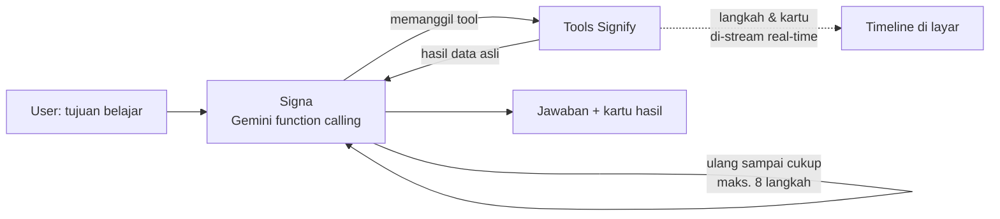
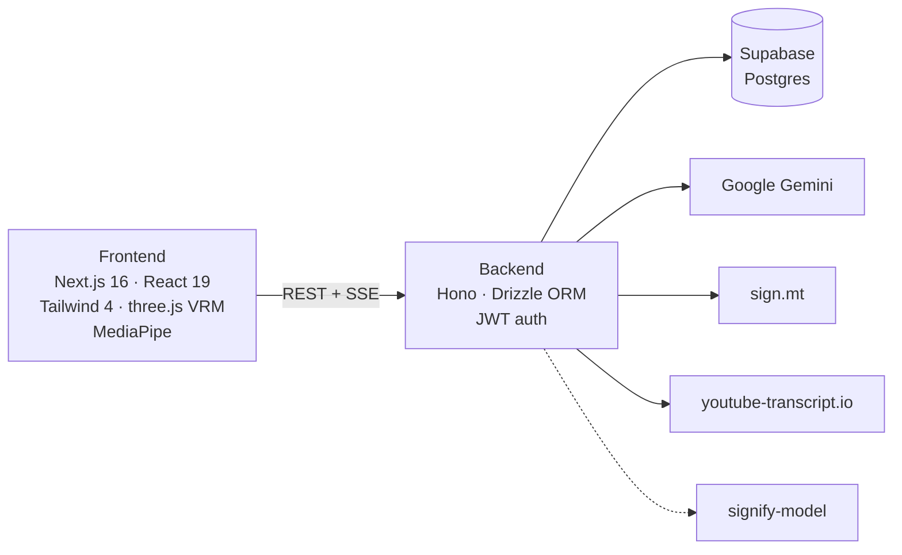

# Signify AI

> **Where Vision Meets Understanding** — platform belajar bahasa isyarat yang inklusif, dengan avatar 3D yang bisa berisyarat dan **Signa**, AI agent yang menjadi pelatih belajar pribadi.

Live demo: [ai-signify.com](https://ai-signify.com)

---

## 1. Masalah yang ingin diselesaikan

- Komunikasi antara teman **Tuli** dan teman dengar masih sering terhambat, termasuk di sekolah, kampus, dan saat wawancara kerja.
- Materi belajar (video, artikel, dokumen) jarang tersedia dalam bentuk yang ramah untuk teman Tuli.
- Belajar bahasa isyarat itu sulit dilakukan sendiri. Tidak ada yang memberi contoh gerakan, menilai gerakan kita, atau mengingatkan kita untuk mengulang.

## 2. Apa itu Signify AI?

Signify AI adalah platform web untuk **belajar dan memakai bahasa isyarat** dengan bantuan AI. Ada tiga pilarnya:

| Pilar | Isinya |
|---|---|
| **Communication Bridge** | Avatar 3D menerjemahkan teks dan video YouTube ke bahasa isyarat. Kamera bisa merekam isyarat untuk diterjemahkan ke teks. |
| **Content Accessibility** | Materi belajar dibuat ramah untuk teman Tuli: avatar berisyarat mengikuti video, ada transcript, dan ada chatbot yang menjawab dari isi materi. |
| **Active Sign Practice** | Latihan isyarat di depan kamera dengan skor otomatis, kuis isyarat, dan pengulangan kosakata terjadwal. |

Di atas ketiga pilar itu ada **Signa (Signify Coach)**, AI agent yang bisa memakai semua fitur di atas untuk membantu user mencapai tujuan belajarnya.

---

## 3. Target pengguna

> Signify dibuat untuk **orang Tuli** agar bisa mengakses pendidikan dan dunia kerja secara setara, dan untuk **siapa saja yang ingin belajar bahasa isyarat** supaya komunikasi Tuli–dengar jadi lebih mudah.

Setiap kelompok memakai Signify dengan cara yang berbeda:

| Pengguna | Signify untuk mereka adalah… | Fitur utama |
|---|---|---|
| **Orang Tuli** (pelajar K-12, vokasi, mahasiswa, pencari kerja & pekerja) | **Akses** ke materi, kelas, dan dunia kerja | Live Translator (video/kelas online → isyarat), materi aksesibel + chatbot, Sign → Text, Signa sebagai tutor materi |
| **Orang dengar** (keluarga, teman, guru/dosen, HR, rekan kerja) | **Tempat belajar** bahasa isyarat | Sign Practice + skor, kuis "Guess the Sign", My Signs, Signa sebagai pelatih |
| **Orang Tuli yang belum fasih berisyarat** | Belajar isyarat dengan tempo sendiri | Sama seperti orang dengar |
| **Institusi** (sekolah, kampus, lembaga vokasi, perusahaan) *— peluang pengembangan* | Cara membuat materi & lingkungan lebih inklusif | Sign Dictionary (misalnya konten BISINDO), materi aksesibel |

### Kenapa orang Tuli dewasa tetap butuh Signify?

Banyak orang Tuli dewasa sudah fasih berbahasa isyarat. Untuk mereka, Signify **bukan tempat belajar isyarat**. Hambatan terbesar mereka ada di **lingkungan yang tidak bisa berisyarat**: pewawancara, HR, rekan kerja, video training, dan materi kursus yang tidak aksesibel. Karena itu, nilai Signify bagi mereka ada di **akses**.

Tapi tidak semua orang Tuli dewasa fasih:
- **Anak Tuli dari orang tua dengar.** Menurut angka yang sering dikutip dari riset di AS, sekitar 90% anak Tuli lahir dari orang tua dengar. Banyak dari mereka baru mengenal bahasa isyarat saat sudah besar.
- **Lulusan pendidikan oral atau SIBI.** Banyak SLB di Indonesia dulu memakai metode oral atau SIBI, sehingga ada orang Tuli yang tidak lancar BISINDO.
- **Orang yang menjadi Tuli saat dewasa** (late-deafened) dan **hard of hearing.** Mereka memang harus belajar dari awal.

### Contoh: kasus mencari kerja

- **Sisi orang dengar:** HR atau pewawancara belajar isyarat dasar supaya bisa menyambut kandidat Tuli.
- **Sisi orang Tuli:** kandidat mengakses materi persiapan karier yang aksesibel. Mereka juga bisa mempelajari isyarat untuk istilah teknis di bidangnya, karena istilah profesional sering belum punya isyarat baku.

### Posisi Signify

- **Pelengkap, bukan pengganti Juru Bahasa Isyarat (JBI).** Signify membantu saat JBI tidak tersedia, misalnya untuk video, materi mandiri, dan latihan sehari-hari.
- **Bahasa isyarat:** saat ini avatar memakai ASL. Infrastruktur **BISINDO** sudah siap lewat Sign Dictionary, dan kontennya idealnya dibangun bersama komunitas Tuli.

---

## 4. ⭐ Signa — AI Agent (Signify Coach)

Signa bukan chatbot biasa. Signa adalah **agent**: dia **mengecek data asli user, membuat rencana, lalu bertindak langsung di dalam aplikasi** memakai tools. Setelah itu baru dia menjawab.

### Contoh

User menulis: *"Minggu depan aku interview kerja, bantu aku siap pakai bahasa isyarat."*

Signa lalu bekerja sendiri:

1. 🔍 **Checking your progress**: membaca streak, isyarat yang sering salah, skor latihan, dan materi yang sedang dikerjakan.
2. 📚 **Searching learning materials**: mencari materi Career dan interview.
3. 📅 **Building your study plan**: menyusun rencana belajar per hari, dan setiap tugas bisa diklik.
4. 📝 **Creating a personal sign quiz**: membuat kuis "Guess the Sign" berisi frasa interview. Kuis ini khusus untuk user tersebut.
5. 🔖 **Adding signs to My Signs**: memasukkan kosakata penting ke jadwal review.
6. 🧍 **Preparing the avatar**: avatar 3D memperagakan frasa kunci seperti *"Hello", "Thank you", "Work"*.

Semua langkah ini **tampil langsung di layar** sebagai timeline. Hasilnya berupa kartu yang bisa diklik (rencana, kuis, kosakata, avatar, materi), lalu ditutup dengan jawaban singkat dalam bahasa yang dipakai user.

### Cara kerja agent

### Tools yang dipakai Signa

| Tool | Fungsinya |
|---|---|
| `get_learner_profile` | Membaca data asli user: streak, coin, tujuan belajar, statistik kosakata, isyarat yang paling sering salah, skor latihan, materi yang sedang dikerjakan |
| `search_materials` | Mencari materi di perpustakaan Signify |
| `get_material_content` | Membaca isi satu materi untuk diringkas atau diambil kosakatanya |
| `get_video_transcript` | Mengambil caption video YouTube yang dibagikan user |
| `create_sign_quiz` | **Membuat kuis isyarat pribadi**: avatar memperagakan istilah, user menebak artinya |
| `add_signs_to_vocabulary` | Menambahkan kata ke My Signs supaya direview terjadwal |
| `demonstrate_signs` | Menampilkan avatar 3D yang memperagakan frasa |
| `recommend_materials` | Menampilkan rekomendasi materi |
| `show_study_plan` | Menampilkan rencana belajar per hari |

### Kenapa Signa terhitung "agent"

- **Perceive:** membaca data belajar asli user, bukan menebak.
- **Plan:** memutuskan sendiri tool mana yang dipanggil dan urutannya.
- **Act:** benar-benar mengubah isi aplikasi, yaitu membuat kuis dan menambah kosakata.
- **Observe & iterate:** hasil setiap tool dipakai untuk langkah berikutnya. Kalau tool gagal, Signa bisa memperbaikinya.
- **Transparan:** setiap langkah terlihat oleh user secara real-time.
- **Punya memori:** riwayat percakapan tersimpan, jadi Signa ingat kuis atau rencana yang sudah dibuat sebelumnya.

### Batasan keamanan (guardrails)

- Semua argumen dari model **divalidasi** dulu sebelum tool dijalankan.
- Signa hanya boleh memakai id materi atau kuis yang benar-benar ada. Id buatan model tidak akan dijadikan link.
- Kuis buatan Signa bersifat **pribadi**, hanya terlihat oleh pemiliknya.
- Jumlah langkah dibatasi (maksimal 8) supaya tidak berputar tanpa henti.
- Seluruh fitur AI bisa dimatikan dari server (`AI_ENABLED`).

---

## 5. Fitur Utama

### 🎥 Live Translator
- **Text → Sign:** user mengetik teks, lalu avatar 3D memperagakannya.
- **YouTube → Sign:** user menempelkan link video, lalu avatar berisyarat **sinkron dengan video**. Transcript punya timestamp dan bisa diklik untuk lompat ke bagian itu.
- **Sign → Text:** kamera merekam titik gerakan tubuh dan tangan (MediaPipe), lalu dikirim ke model pengenalan isyarat *(sedang dikembangkan)*.

### 🧍 Avatar 3D yang bisa dikustomisasi
- Avatar VRM (three.js) memperagakan bahasa isyarat dari data gerakan (file `.pose`).
- Tampilan avatar (model, rambut, mata, aksesoris) bisa diubah di **Shop** memakai coin.

### 📚 Learning Materials
- Materi video, artikel, dan dokumen dengan pencarian dan filter (kategori, tipe, bahasa).
- Video dilengkapi **avatar berisyarat mengikuti transcript**. Avatarnya bisa digeser.
- **Chatbot materi (Gemini):** menjawab hanya dari isi materi. Setiap jawaban bisa diperagakan avatar lewat tombol **"Sign this"**.
- Progres dan status selesai tercatat per materi.

### ✋ Sign Practice (dengan skor AI)
- Avatar menunjukkan contoh isyarat, lalu user merekam dirinya lewat webcam.
- Bentuk dan gerakan tangan user dibandingkan dengan gerakan avatar (**MediaPipe + Dynamic Time Warping**), menghasilkan **skor 0–100**.
- Skor ≥ 60 dinyatakan lolos dan mendapat coin. Kata yang dilatih otomatis masuk My Signs.

### 📝 Quizzes
- Kuis gambar ke istilah, istilah ke gambar, dan **"Guess the Sign"** (avatar memperagakan, user menebak artinya).
- Umpan balik langsung, akurasi, timer, coin, dan review jawaban.

### 🔖 My Signs (Spaced Repetition)
- Kamus pribadi berisi kata dari latihan, kuis, translator, dan Signa.
- Review model flashcard: avatar memperagakan, user mengingat artinya, lalu menilai **Again / Hard / Good / Easy**.
- Jadwal review diatur algoritma **SM-2** (mirip Anki). Kata dianggap *mastered* setelah intervalnya ≥ 21 hari.

### 🌏 Multi bahasa isyarat
- Pilihan **ASL** dan **BISINDO** di Settings.
- **Sign Dictionary:** admin bisa mengunggah gerakan (`.pose`) per kata, misalnya untuk BISINDO. Kamus ini dipakai lebih dulu, baru sisanya ke sign.mt.

### 🎮 Gamifikasi & Dashboard
- Coin, streak harian, rank di leaderboard, daily goal, dan daily quiz.
- Dashboard pribadi: progres, rekomendasi materi, aktivitas terakhir, dan jumlah isyarat yang perlu direview.

---

## 6. Di mana saja AI dipakai

| Komponen AI | Teknologi | Dipakai di |
|---|---|---|
| **Signa (AI agent)** | Google Gemini 2.5 Flash + function calling | Signify Coach |
| **Chatbot materi** | Google Gemini 2.5 Flash | Learning Materials |
| **Teks → isyarat** | sign.mt + Sign Dictionary lokal | Avatar di seluruh aplikasi |
| **Deteksi tangan & tubuh** | MediaPipe Hand/Pose Landmarker (di browser) | Sign Practice, Sign → Text |
| **Penilaian isyarat** | Normalisasi landmark + Dynamic Time Warping | Sign Practice |
| **Isyarat → teks** | signify-model (Transformer + CTC) | Live Translator *(dalam pengembangan)* |
| **Penjadwalan belajar** | Algoritma SM-2 | My Signs |

---

## 7. Arsitektur & Tech Stack

- **Frontend:** Next.js 16 (App Router), React 19, TypeScript, Tailwind CSS v4, three.js + `@pixiv/three-vrm`, MediaPipe Tasks Vision.
- **Backend:** Hono (Node), Drizzle ORM, Supabase Postgres, JWT + bcrypt, validasi zod, dokumentasi OpenAPI/Swagger.
- **AI:** Google Gemini (agent + chatbot), sign.mt (teks → gerakan), signify-model (isyarat → teks).
- **Streaming:** langkah-langkah agent dikirim ke browser secara real-time lewat Server-Sent Events.

---

## 8. Alur demo (± 5 menit)

1. **Landing page** (30 dtk): sampaikan misi Signify dan perkenalkan Signa.
2. **Dashboard** (30 dtk): tunjukkan progres, streak, dan badge review My Signs.
3. **⭐ Signa** (2 mnt): klik *"Prepare for a job interview"*. Tunjukkan langkah-langkah yang muncul real-time, lalu buka kuis yang baru dibuat.
4. **Live Translator** (1 mnt): tempel link YouTube dan tunjukkan avatar berisyarat mengikuti video.
5. **Sign Practice** (1 mnt): rekam satu isyarat dan tunjukkan skornya.
6. **Penutup:** My Signs dan gamifikasi membuat user kembali belajar setiap hari.

---

## 9. Status & rencana berikutnya

| Bagian | Status |
|---|---|
| Signa (AI agent), chatbot, translator teks/video, sign practice, kuis, My Signs | ✅ Sudah dibangun |
| Konten gerakan **BISINDO** di Sign Dictionary | 🔄 Infrastruktur siap, konten gerakan perlu diunggah |
| **Isyarat → teks** (signify-model) | 🔄 Alur kamera & API siap, menunggu server model (kosakata model masih terbatas) |
| Kalibrasi skor Sign Practice | 🔄 Perlu diuji dengan lebih banyak data asli |

**Rencana berikutnya:**
- Signa bisa mengubah video YouTube jadi materi belajar lengkap.
- Signa memberi saran perbaikan gerakan setelah latihan.
- Konten BISINDO yang lebih lengkap.
